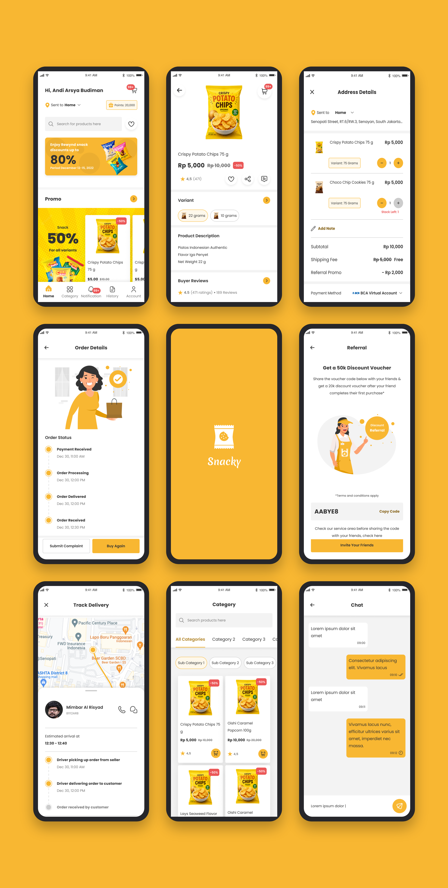

# Snacky App Design System

Design system for **Snacky**, a snack e-commerce mobile app - targeting Kotlin
Compose Multiplatform and React.

**Live site:** https://rezatresnas.github.io/snacky-design-system/



## What's in this repo

| Path | What it is |
|---|---|
| [`index.html`](index.html) | The interactive doc site itself - visual specs with measurement overlays, live Figma embeds, and an editable React playground per component. 22 components across Actions, Forms, Navigation, Content, and Assets, plus foundation tokens (color, typography, spacing, radius, sizing, shadow). |
| [`tokens.json`](tokens.json) | All design tokens in [W3C Design Tokens](https://design-tokens.github.io/community-group/format/) format. |
| [`components.json`](components.json) | Every component's variants/states with real spec values and working Kotlin (Compose Multiplatform) + React (TSX) code samples. |
| [`packages/react-ui`](packages/react-ui) | `@snacky/ui` on npm - a real, installable React implementation of all 22 components, styled entirely from the tokens above. |
| [`packages/compose-ui`](packages/compose-ui) | The Kotlin Multiplatform / Compose Multiplatform counterpart, all 22 components, published via JitPack. Generated from the same source as the React package, so the two cannot drift apart. |
| [`llms.txt`](llms.txt) / [`AGENTS.md`](AGENTS.md) | Entry points for AI coding tools - point an agent here instead of scraping the HTML. |
| [`design-system-prompt.md`](design-system-prompt.md) | Condensed copy-paste version of the above for tools that take a text prompt instead of reading files (Stitch, v0, Bolt, Claude Artifacts). |

`tokens.json` and `components.json` are generated from `index.html` by
[`scripts/generate-agent-files.js`](scripts/generate-agent-files.js) - never
hand-edited, always in sync with what a human sees on the site.

## Using the components

**React** - published at [npmjs.com/package/@snacky/ui](https://www.npmjs.com/package/@snacky/ui):

```bash
npm install @snacky/ui
```

```tsx
import '@snacky/ui/styles.css';
import { Button, TextField, Checkbox } from '@snacky/ui';
```

**Compose Multiplatform** - published via [JitPack](https://jitpack.io/#rezatresnas/snacky-design-system):

```kotlin
// settings.gradle.kts -> repositories
maven("https://jitpack.io")

// build.gradle.kts
implementation("com.github.rezatresnas:snacky-design-system:compose-v1.0.11")
```

See [`packages/react-ui/README.md`](packages/react-ui/README.md) for the full
component list, verification status, and known gaps.

## Using this with an AI tool

- **Reads files or runs npm/JitPack** (Claude Code, Cursor, most coding agents,
  or "Create using Claude Code" in Claude Design): point it at
  [`llms.txt`](llms.txt) (or [`AGENTS.md`](AGENTS.md), same index in the
  convention some agents look for by default) - it lists the machine-readable
  token/component data and the installable packages, so the agent builds real
  UI instead of re-deriving values from screenshots.
- **Takes a prompt but can't read files** (Google Stitch, v0, Bolt, Lovable's
  chat box, Claude Artifacts): paste [`design-system-prompt.md`](design-system-prompt.md)
  into its prompt/system-context box instead.

## Roadmap

- [x] Publish `@snacky/ui` to npm
- [x] Kotlin Compose Multiplatform component package, published via JitPack
- [x] Full icon set - all 42 Outline + 11 Solid, exported from Figma's real
      icon components (CC BY 4.0, see [NOTICE](NOTICE))

## License

[MIT](LICENSE) (c) rezatresnas
